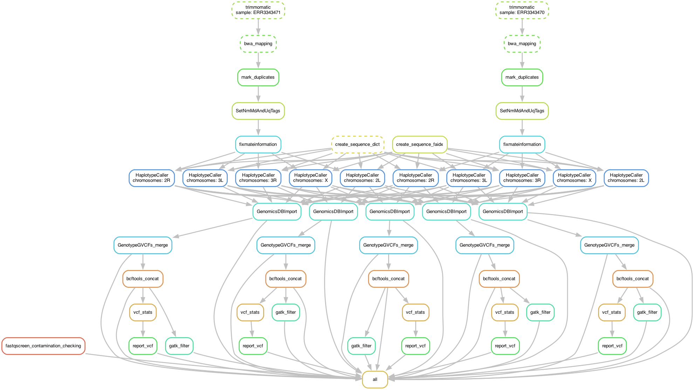

# SHAVE2: SHort-read Alignment pipeline for VEctor v.2  - with HaplotypeCaller variant caller - SLURM version #


 | Catalina (10.15.7) | Big Sure (11.6.3) | Monterey (12.2.0)/E6055C?icon=apple&label&list=|&scale=0.9>)
 | Focal Fossa (20.04) | Jammy Jellyfish (22.04)/772953?icon=https://www.svgrepo.com/show/25424/ubuntu-logo.svg&label&list=|&scale=0.9>)


## ~ ABOUT ~ ##

SHAVE2 is a bioinformatic pipeline used for mosquitoes (*Aedes / Anopheles*) genome alignments from Illumina short reads, based on GATK Best Practices, except for the BQSR and VQSR steps. 

In brief, SHAVE2 remove adatpers, report quality reads, aligns reads to a reference genome, fix incorrect mates, mark duplicates, add indel qualities to BAM files and call variants and genotypes.

### Note about Variant and Genotype Calling ###

Indel realignment was dropped by Broad Institute about three years ago, as they found that this step was no longer useful when the variant calling was done with HaplotypeCaller or Mutect2, which implement a more sophisticated and effective form of realignment. [see here](https://gatk.broadinstitute.org/hc/en-us/articles/360038154292/comments/360010778692). SHAVE2 use HaplotypeCaller in ERC mode to call variants and obtain the genotype likelihoods. Then, GenomicsDBImport import single-sample GVCFs into GenomicsDB before GenotypeGVCFs perform a joint genotyping on samples pre-called with HaplotypeCaller. The last major step is a fully customizable hard-filtering, using GATK VariantFiltration instead of Variant Qualtity Score Recalibration (VQSR).

### Note about BQSR and VQSR ###

*Base Quality Score Recalibration* step needs as input a *known variation* VCF file, refering to the Ensembl-Variation database or dbSNP database who stores areas of genome that differ between individual genomes ("variants"). However, we do not have any prior list of known variants for our mosquito species, that's why we cannot do BQSR. 

But the value of BQSR is [increasingly being questioned](https://bmcbioinformatics.biomedcentral.com/articles/10.1186/s12859-016-1279-z#Abs1) as mappers and callers are typically updated. As an example: using HaplotypeCaller instead of UnifiedGenotyper greatly improves the handling of indels.

*Variant Quality Score recalibration* is probably the hardest part of the Best Practices to get right [according to Broad Institute](https://gatk.broadinstitute.org/hc/en-us/articles/4413056319131-VariantRecalibrator). In a nutshell, it is a sophisticated filtering technique applied on the variant callset that uses machine learning to model the technical profile of variants in a training set and uses that to filter out probable artifacts from the callset.

The key point is that it use known, highly validated variant resources (omni, 1000 Genomes, hapmap) to select a subset of variants within our callset that we’re really confident are probably true positives (the training set). Unfortunately, no highly validated variant resource is available for mosquitoes at this time, so we decided to apply hard-filtering and leave the choice of parameters to the user. 

Written for **MOVE-ADAPT** project. 

### Features ###
- Control reads quality (_multiQC html report_) and clean it  
- Align reads (_bam files_), 
- Mark duplicates to BAM files,
- Add MD and NM tag to BAM files,
- Fix mates,
- BAM file validation according to SAM/BAM specifications,
- Variants calling (_vcf files_),
- Genotyping, 
- VCF compression,
- VCF indexing

### Version ###
*V2.2023.07.13*  

### Directed Acyclic Graph ###



## ~ INSTALLATIONS ~ ##

# Conda _(required)_ #
Install **Conda**: [Latest Miniconda Installer](https://docs.conda.io/en/latest/miniconda.html#latest-miniconda-installer-links)
 
**Miniconda3 for MacOSX-64-bit**  
_Follow the screen prompt instructions_  
```shell
curl https://repo.anaconda.com/miniconda/Miniconda3-latest-MacOSX-x86_64.sh -o ./Miniconda3-latest-MacOSX-x86_64.sh 
bash ./Miniconda3-latest-MacOSX-x86_64.sh
rm -f ./Miniconda3-latest-MacOSX-x86_64.sh
```

**Miniconda3 for MacOSX-arm64-bit**  
_Follow the screen prompt instructions_  
```shell
curl https://repo.anaconda.com/miniconda/Miniconda3-latest-MacOSX-arm64.sh -o ./Miniconda3-latest-MacOSX-arm64.sh 
bash ./Miniconda3-latest-MacOSX-arm64.sh
rm -f ./Miniconda3-latest-MacOSX-arm64.sh
```

**Miniconda3 on Linux-64-bit**  
_Follow the screen prompt instructions_  
```shell
wget https://repo.anaconda.com/miniconda/Miniconda3-latest-Linux-x86_64.sh
bash ./Miniconda3-latest-Linux-x86_64.sh
rm -f ./Miniconda3-latest-Linux-x86_64.sh
```

- Please, **restart** now your shell, i.e. closing and opening a new terminal window

- **Note on Apple Silicon processors:** as long as some programs will not be natively proposed for these ARM processors, it is imperative to create a conda environment exclusively for osx-64 for intel processor and let the excellent **Rosetta emulator** do the job (tested on a MacBook Pro M1 Pro):  
 
```shell
CONDA_SUBDIR=osx-64 conda create -n myenv_x86
conda activate myenv_x86
conda config --env --set subdir osx-64
```

# SHAVE2 #
Clone _(HTTPS)_ the [SHAVE2](https://github.com/ltalignani/SHAVE2) repository on github:

```shell
git clone git@github.com:ltalignani/SHAVE2.git
cd ./SHAVE2/
```

Difference between **Download** and **Clone**:  
- To create a copy of a remote repository’s files on your computer, you can either **Download** or **Clone** the repository  
- If you download it, you **cannot sync** the repository with the remote repository on GitHub  
- Cloning a repository is the same as downloading, except it preserves the Git connection with the remote repository  
- You can then modify the files locally and upload the changes to the remote repository on GitHub  
- You can then **update** the files locally and download the changes from the remote repository on GitHub  
```shell
git pull --verbose
```

## ~ USAGE ~ ##

1. Copy your **paired-end** reads in **.fastq.gz** format files into: **./resources/reads/** directory
2. Execute the **Start_shave2.sh** bash script to run the SHAVE2 pipeline
    - with a **Double-click** on it _(if default app for .sh files is iTerm2 or Terminal.app on a Mac)_
	- with a **Right-click** > **Open with** > **iTerm2 / Terminal.app** _(Mac)_
	- with **CLI** from a terminal _(Mac / Linux)_
```shell
bash Start_shave2.sh
```
Yours analyzes will start with default configuration settings  

_Option-1: Edit **config.yaml** file in **./config/** directory_  
_Option-2: Edit **fastq-screen.conf** file in **./config/** directory_  


## ~ RESULTS ~ ##

Yours results are available in **./results/** directory, as follow:  
_(file names keep track which tools / params was used: \<**sample**\>\_\<**aligner**\>\_\<**mincov**\>)_  

### root ###
This is the main results :   

- **All_genome_coverages.tsv**: all genome coverages, in _tsv_ format
- **All_readsQC_reports.html**: all reads quality reports from MultiQC, in _html_ format

### 00_Quality_Control ###
| File | Object |
|:--- | :--- |
| **fastq-screen** | raw reads putative contaminations reports for each samples, in _html_, _png_ and _txt_ formats |
| **fastqc** | raw reads quality reports for each samples, in _html_ and _zip_ formats |
| **multiqc** | fastq-screen and fastqc results agregation report for all samples, in _html_ format |

### 01_Trimming ###
| File | Object |
|:--- | :--- |
| **sickle/ directory** | paired reads, without adapters and quality trimmed, in _fastq.gz_ format
| _cutadapt/ directory_ | paired reads, without adapters (default config: tempdir, removed, save disk usage)_ |

### 02_Mapping ###

| File | Object |
|:--- | :--- |
| **mark-dup.bam** | read alignments, in _bam_ format _(can be visualized in, i.e. IGV)_ |
| **mark-dup.bai** | bam indexes _bai_ use in i.e. IGV with _./resources/genomes/AalbF3.fasta_ |
| **mark-dup.bam.sbi** | bam splitting index (needed by Spark for Picard MarkDuplicates |
| **markdup_metrics.txt** | bam metrics created by Picard MarkDuplicates |
| _mapped.sam_ | (default config: tempdir, removed, save disk usage)_ |
| _sortbynames.bam_ | (default config: tempdir, removed, save disk usage)_ |
| _fixmate.bam_ | (default config: tempdir, removed, save disk usage)_ |
| _sorted.bam_ | (default config: tempdir, removed, save disk usage)_ |
| _sorted_MD.bam_ | (default config: tempdir, removed, save disk usage)_ |

### 03_Coverage ###
| File | Object |
|:--- | :--- |
| **coverage-stats.tsv** | information about genome coverage, in _tsv_ format containing mean coverage depth across all genome reference sequence, standard deviation for mean-depth and genome reference coverage percentage at at-least n X of depth. |

### 04_Variants ###
| File | Object |
|:--- | :--- |
| **maskedref.fasta** | reference sequence, masked for low coverage regions, in _fasta_ format |
| **maskedref.fasta.fai** | reference sequence indexes, masked for low coverages regions, in _fai_ format |
| **indelqual.bam** | read alignments with indel qualities, in _bam_ format _(can be visualized in, i.e. IGV)_ |
| **indelqual.bai** | bam indexes _bai_ use in i.e. IGV with _./results/04_Variants/maskedref.fasta_ |
| **variant-filt.vcf.gz** | SNVs and Indels passing filters archive, in _vcf.gz_ format |
| **variant-filt.vcf.gz.tbi** | SNVs and Indels passing filters archive indexed, in _vcf.bgz.tbi_ format |
|  |  |
| **haplotypecaller directory**: |  |
| _variant-call.g.vcf_ | SNVs and Indels calling in _gvcf_ format (default config: tempdir, removed, save disk usage)_ |
| _variant-call.g.vcf.idx_ | SNV and Indels calling in _idx_ format (default config: tempdir, removed, save disk usage)_
|  |  |
| **genomicdb** | g.vcfs merged by GenomicsDBImport for GenotypeGVCFs |
| **genotypegvcfs directory**: |  |
| _genotyped.vcf_ | SNVs genotyped in _vcf_ format |
| _genotyped.vcf.idx_ | genotype index in _idx_ format (automatically generated by GenotypeGVCFs) |
|  |  |
| **variantfiltration directory**: |  |
| _hardfiltered.vcf_ | genotyped SNVs hard-filtered, in _vcf_ format (default config: tempdir, removed, save disk usage)_ |
| _hardfiltered.vcf.idx_ | index in _idx_ format (default config: tempdir, removed, save disk usage)_ |

### 05_Validation ###
- **mark-dup.txt**: statistics of all reads, produced by samtools stats, in _txt_ format

### 10_graphs ###
| File | Object |
|:--- | :--- |
| **dag** | directed acyclic graph of jobs, in _pdf_ and _png_ formats |
| **rulegraph** | dependency graph of rules, in _pdf_ and _png_ formats _(less crowded than above DAG of jobs, but also show less information)_  |
| **filegraph** | dependency graph of rules with their input and output files in the dot language, in _pdf_ and _png_ formats _(an intermediate solution between above DAG of jobs and the rule graph)_ |

### 11_Reports ###
- All _non-empty_ **log** for each tool and each sample
- files_summary.txt: summary of all files created by the workflow, in _txt_ format  
_(columns: filename, modification time, rule version, status, plan)_


## ~ CONFIGURATION ~ ##

If needed, see or edit default settings in **config.yaml** file in **./config/** directory  

### Resources ###
Edit to match your hardware configuration  
- **cpus**: for tools that can _(i.e. bwa)_ use at most n cpus to run in parallel _(default config: '8')_  **Note**: snakemake (if launched with default bash script) will always use all cpus to parallelize jobs.
- **mem_gb**: for tools that can _(i.e. samtools)_ limit its use of memory to max n Gb _(default config: '16' Gb)_. 
- **tmpdir**: for tools that can specify where you want the temp stuff _(default config: '$TMPDIR')_

### Environments ###
Edit if you want to change some environments _(i.e. new version)_ in ./workflow/envs/tools-version.yaml files

### Aligner ###
You can choose to align your reads using either **BWA** or **Bowtie2** or both tools  
To select one or both, de/comment (#) as you wish:

- **bwa**: faster _(default config)_
- **bowtie2**: slower, sensitivity required could be set _(see below "Bowtie2" options)_

### Consensus ###
- **reference**: reference sequence path used for genome mapping _(default config: 'AalbF3')_
- **mincov**: minimum coverage for masking to low covered regions in final consensus sequence _(default config: '10')_

### Variant ###
- **covmin**: minimum coverage allowed for SNVs and InDels filtering, if < 1 = off _(default config: '10' (INT))_
- **afmin**: minimum allele frequency allowed for SNVs and InDels filtering, if < 0 = off _(default config: '0.1' (FLOAT))_

### BWA ###
- **index**: reference index path for bwa _(default config: 'AalbF3')_

### Bowtie2 ###
- **index**: reference index path for bowtie2 _(default config: 'AalbF3')_
- **sensitivity**: preset for bowtie2 sensitivity _(default config: '--sensitive')_

### Sickle-trim ###
- **command**: Pipeline wait for paired-end reads _(default config: 'pe')_
- **encoding**: If your data are from recent Illumina run, let 'sanger' _(default config: 'sanger')_
- **quality**: [Q-phred score](https://en.wikipedia.org/wiki/Phred_quality_score) limit _(default config: '30')_
- **length**: read length limit, after trim _(default config: '25')_

### Cutadapt ###
- **length**: discard reads shorter than length, after trim _(default config: '25')_
- **kits**: sequence of an adapter ligated to the 3' end of the first read _(default config: 'truseq', 'nextera' and 'small' Illumina kits)  

### Fastq-Screen ###
- **config**: path to the fastq-screen configuration file _(default config: ./config/fastq-screen.conf)_
- **subset**: do not use the whole sequence file, but create a temporary dataset of this specified number of read _(default config: '1000')_
- **aligner**: specify the aligner to use for the mapping. Valid arguments are 'bowtie', bowtie2' or 'bwa' _(default config: 'bwa')_

#### fastq-screen.conf ####
- **databases**: enables you to configure multiple genomes databases _(aligner index files)_ to search against

### Glossary ###
- **BAM**: Binary Alignment Map
- **BAI**: BAM Indexes
- **FASTA**: Fast-All
- **FASTQ**: FASTA with Quality
- **FAI**: FASTA Indexes
- **SAM**: Sequence Alignment Map

### Directories tree structure ###
```shell
🖥️️ Start_shave2.sh
📚 README.md
🍜 snakemake.yaml
📂 visuals/
 └── 📈 newDAG.png
📂 config/
 ├── ⚙️ config.yaml
 └── ⚙️ fastq-screen.conf
📂 resources/
 ├── 📂 genomes/
 │    └── 🧬 AalbF3.fasta
 ├── 📂 indexes/
 │    ├── 📂 bowtie2/
 │    │    └── 🗂️ AalbF3
 │    └── 📂 bwa/
 │         ├── 🗂️ AalbF3
 │         ├── 🗂️ Adapters
 │         
 └── 📂 reads/  
 │    ├── 🛡️ .gitkeep
 │    ├── 📦 ERR3343471_R1.fastq.gz
 │    └── 📦 ERR3343471_R2.fastq.gz
📂 workflow/
 ├── 📂 envs/
 │    ├── 🍜 bcftools-1.14.yaml
 │    ├── 🍜 bedtools-2.30.0.yaml
 │    ├── 🍜 bowtie2-2.4.4.yaml
 │    ├── 🍜 bwa-0.7.17.yaml
 │    ├── 🍜 cutadapt-3.5.yaml
 │    ├── 🍜 fastq-screen-0.14.0.yam
 │    ├── 🍜 fastqc-0.11.9.yaml
 │    ├── 🍜 gatk-3.8.yaml
 │    ├── 🍜 gatk-4.3.0.0.yaml
 │    ├── 🍜 gawk-5.1.0.yaml
 │    ├── 🍜 lofreq-2.1.5.yaml
 │    ├── 🍜 multiqc-1.11.yaml
 │    ├── 🍜 picard-2.27.4.yaml
 │    ├── 🍜 samtools-1.14.yaml
 │    └── 🍜 sickle-trim-1.33.yaml
 └── 📂 rules/
      └── 📜 shave2.smk
```

## ~ SUPPORT ~ ##
1. Read The Fabulous Manual!
2. Read de Awsome Wiki! (todo...)
3. Create a new issue: Issues > New issue > Describe your issue
4. Send an email to [loic.talignani@ird.fr](url)

## ~ ROADMAP ~ ##
- Add a wiki!  

## ~ AUTHORS & ACKNOWLEDGMENTS ~ ##
- Loïc TALIGNANI (Developer and Maintener)  


## ~ CONTRIBUTING ~ ##
Open to contributions!  
Testing code, finding issues, asking for update, proposing new features...  
Use Git tools to share!  

## ~ PROJECT STATUS ~ ##
This project is **regularly updated** and **actively maintened**  
However, you can be volunteer to step in as **developer** or **maintainer**  

For information about main git roles:  
- **Guests** are _not active contributors_ in private projects, they can only see, and leave comments and issues
- **Reporters** are _read-only contributors_, they can't write to the repository, but can on issues  
- **Developers** are _direct contributors_, they have access to everything to go from idea to production  
_Unless something has been explicitly restricted_  
- **Maintainers** are _super-developers_, they are able to push to master, deploy to production  
_This role is often held by maintainers and engineering managers_  
- **Owners** are essentially _group-admins_, they can give access to groups and have destructive capabilities  

## ~ LICENSE ~ ##
[GPLv3](https://www.gnu.org/licenses/gpl-3.0.html)  

## ~ REFERENCES ~ ##
**Sustainable data analysis with Snakemake**  
Felix Mölder, Kim Philipp Jablonski, Brice Letcher, Michael B. Hall, Christopher H. Tomkins-Tinch, Vanessa Sochat, Jan Forster, Soohyun Lee, Sven O. Twardziok, Alexander Kanitz, Andreas Wilm, Manuel Holtgrewe, Sven Rahmann, Sven Nahnsen, Johannes Köster  
_F1000Research (2021)_  
**DOI**: [https://doi.org/10.12688/f1000research.29032.2](https://doi.org/10.12688/f1000research.29032.2)  
**Publication**: [https://f1000research.com/articles/10-33/v1](https://f1000research.com/articles/10-33/v1)  
**Source code**: [https://github.com/snakemake/snakemake](https://github.com/snakemake/snakemake)  
**Documentation**: [https://snakemake.readthedocs.io/en/stable/index.html](https://snakemake.readthedocs.io/en/stable/index.html)  

**Anaconda Software Distribution**  
Team  
_Computer software (2016)_  
**DOI**: []()  
**Publication**: [https://www.anaconda.com](https://www.anaconda.com)  
**Source code**: [https://github.com/snakemake/snakemake](https://github.com/snakemake/snakemake) (conda)  
**Documentation**: [https://snakemake.readthedocs.io/en/stable/index.html](https://snakemake.readthedocs.io/en/stable/index.html) (conda)  
**Source code**: [https://github.com/mamba-org/mamba](https://github.com/mamba-org/mamba) (mamba) 
**Documentation**: [https://mamba.readthedocs.io/en/latest/index.html](https://mamba.readthedocs.io/en/latest/index.html) (mamba)  

**Tabix: fast retrieval of sequence features from generic TAB-delimited files**  
Heng Li  
_Bioinformatics, Volume 27, Issue 5 (2011)_  
**DOI**: [https://doi.org/10.1093/bioinformatics/btq671](https://doi.org/10.1093/bioinformatics/btq671)  
**Publication**: [https://www.ncbi.nlm.nih.gov/pmc/articles/PMC3042176/](https://www.ncbi.nlm.nih.gov/pmc/articles/PMC3042176/)  
**Source code**: [https://github.com/samtools/samtools](https://github.com/samtools/samtools)  
**Documentation**: [http://samtools.sourceforge.net](http://samtools.sourceforge.net)  

**GATK: A MapReduce framework for analyzing next-generation DNA sequencing data**
_Genome Research, Volume 20: 1297-1303 (2010)_
**DOI**: [https://doi.org/10.1101/gr.107524.110](https://doi.org/10.1101/gr.107524.110)
**Publication**: [https://genome.cshlp.org/content/20/9/1297](https://genome.cshlp.org/content/20/9/1297)
**Source code**:[https://github.com/broadinstitute/gatk](https://github.com/broadinstitute/gatk)
**Documentation**:[https://gatk.broadinstitute.org/hc/en-us](https://gatk.broadinstitute.org/hc/en-us)

**Picard-tools: **
_Broad Institute, GitHub repository (2019)_
**DOI**:
**Publication**: 
**Source code**:https://github.com/broadinstitute/picard](https://github.com/broadinstitute/picard)
**Documentation**:[https://broadinstitute.github.io/picard/](https://broadinstitute.github.io/picard/)

**LoFreq: a sequence-quality aware, ultra-sensitive variant caller for uncovering cell-population heterogeneity from high-throughput sequencing datasets**  
Andreas Wilm, Pauline Poh Kim Aw, Denis Bertrand, Grace Hui Ting Yeo, Swee Hoe Ong, Chang Hua Wong, Chiea Chuen Khor, Rosemary Petric, Martin Lloyd Hibberd and Niranjan Nagarajan  
_Nucleic Acids Research, Volume 40, Issue 22 (2012)_  
**DOI**: [https://doi.org/10.1093/nar/gks918](https://doi.org/10.1093/nar/gks918)  
**Publication**: [https://pubmed.ncbi.nlm.nih.gov/23066108/](https://pubmed.ncbi.nlm.nih.gov/23066108/)  
**Source code**: [https://gitlab.com/treangenlab/lofreq](https://gitlab.com/treangenlab/lofreq) _(v2 used)_  
**Source code**: [https://github.com/andreas-wilm/lofreq3](https://github.com/andreas-wilm/lofreq3) _(see also v3 in Nim)_  
**Documentation**: [https://csb5.github.io/lofreq](https://csb5.github.io/lofreq)  

**The AWK Programming Language**  
Al Aho, Brian Kernighan and Peter Weinberger  
_Addison-Wesley (1988)_  
**ISBN**: [https://www.biblio.com/9780201079814](https://www.biblio.com/9780201079814)  
**Publication**: []()  
**Source code**: [https://github.com/onetrueawk/awk](https://github.com/onetrueawk/awk)  
**Documentation**: [https://www.gnu.org/software/gawk/manual/gawk.html](https://www.gnu.org/software/gawk/manual/gawk.html)  

**BEDTools: a flexible suite of utilities for comparing genomic features**  
Aaron R. Quinlan and Ira M. Hall  
_Bioinformatics, Volume 26, Issue 6 (2010)_  
**DOI**: [https://doi.org/10.1093/bioinformatics/btq033](https://doi.org/10.1093/bioinformatics/btq033)  
**Publication**: [https://academic.oup.com/bioinformatics/article/26/6/841/244688](https://academic.oup.com/bioinformatics/article/26/6/841/244688)  
**Source code**: [https://github.com/arq5x/bedtools2](https://github.com/arq5x/bedtools2)  
**Documentation**: [https://bedtools.readthedocs.io/en/latest/](https://bedtools.readthedocs.io/en/latest/)  

**Twelve years of SAMtools and BCFtools**  
Petr Danecek, James K Bonfield, Jennifer Liddle, John Marshall, Valeriu Ohan, Martin O Pollard, Andrew Whitwham, Thomas Keane, Shane A McCarthy, Robert M Davies and Heng Li  
_GigaScience, Volume 10, Issue 2 (2021)_  
**DOI**: [https://doi.org/10.1093/gigascience/giab008](https://doi.org/10.1093/gigascience/giab008)  
**Publication**: [https://academic.oup.com/gigascience/article/10/2/giab008/6137722](https://academic.oup.com/gigascience/article/10/2/giab008/6137722)  
**Source code**: [https://github.com/samtools/samtools](https://github.com/samtools/samtools)  
**Documentation**: [http://samtools.sourceforge.net](http://samtools.sourceforge.net)  

**Fast and accurate short read alignment with Burrows-Wheeler Transform**  
Heng Li and Richard Durbin  
_Bioinformatics, Volume 25, Aricle 1754-60 (2009)_  
**DOI**: [https://doi.org/10.1093/bioinformatics/btp324](https://doi.org/10.1093/bioinformatics/btp324)  
**Publication**: [https://pubmed.ncbi.nlm.nih.gov/19451168@](https://pubmed.ncbi.nlm.nih.gov/19451168)  
**Source code**: [https://github.com/lh3/bwa](https://github.com/lh3/bwa)  
**Documentation**: [http://bio-bwa.sourceforge.net](http://bio-bwa.sourceforge.net)  

**Sickle: A sliding-window, adaptive, quality-based trimming tool for FastQ files**  
Joshi NA and Fass JN  
_(2011)  
**DOI**: [https://doi.org/](https://doi.org/)  
**Publication**: []()  
**Source code**: [https://github.com/najoshi/sickle](https://github.com/najoshi/sickle)  
**Documentation**: []()  

**Cutadapt Removes Adapter Sequences From High-Throughput Sequencing Reads**  
Marcel Martin  
_EMBnet Journal, Volume 17, Article 1 (2011)  
**DOI**: [https://doi.org/10.14806/ej.17.1.200](https://doi.org/10.14806/ej.17.1.200)  
**Publication**: [http://journal.embnet.org/index.php/embnetjournal/article/view/200](http://journal.embnet.org/index.php/embnetjournal/article/view/200)  
**Source code**: [https://github.com/marcelm/cutadapt](https://github.com/marcelm/cutadapt)  
**Documentation**: [https://cutadapt.readthedocs.io/en/stable/](https://cutadapt.readthedocs.io/en/stable)  

**MultiQC: summarize analysis results for multiple tools and samples in a single report**  
Philip Ewels, Måns Magnusson, Sverker Lundin and Max Käller  
_Bioinformatics, Volume 32, Issue 19 (2016)_  
**DOI**: [https://doi.org/10.1093/bioinformatics/btw354](https://doi.org/10.1093/bioinformatics/btw354)  
**Publication**: [https://academic.oup.com/bioinformatics/article/32/19/3047/2196507](https://academic.oup.com/bioinformatics/article/32/19/3047/2196507)  
**Source code**: [https://github.com/ewels/MultiQC](https://github.com/ewels/MultiQC)  
**Documentation**: [https://multiqc.info](https://multiqc.info)  

**FastQ Screen: A tool for multi-genome mapping and quality control**  
Wingett SW and Andrews S  
_F1000Research (2018)_  
**DOI**: [https://doi.org/10.12688/f1000research.15931.2](https://doi.org/10.12688/f1000research.15931.2)  
**Publication**: [https://f1000research.com/articles/7-1338/v2](https://f1000research.com/articles/7-1338/v2)  
**Source code**: [https://github.com/StevenWingett/FastQ-Screen](https://github.com/StevenWingett/FastQ-Screen)  
**Documentation**: [https://www.bioinformatics.babraham.ac.uk/projects/fastq_screen](https://www.bioinformatics.babraham.ac.uk/projects/fastq_screen)  

**FastQC: A quality control tool for high throughput sequence data**  
Simon Andrews  
_Online (2010)_  
**DOI**: [https://doi.org/](https://doi.org/)  
**Publication**: []()  
**Source code**: [https://github.com/s-andrews/FastQC](https://github.com/s-andrews/FastQC)  
**Documentation**: [https://www.bioinformatics.babraham.ac.uk/projects/fastqc](https://www.bioinformatics.babraham.ac.uk/projects/fastqc)  
